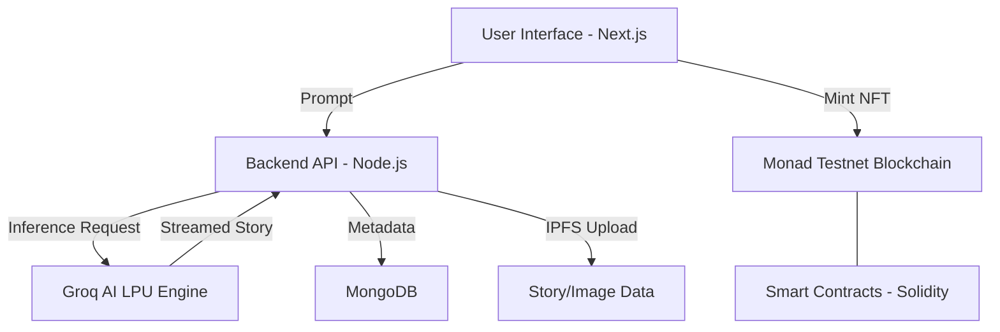

<h1 align="center">GroqTales</h1>
<p align="center"><b>AI-Powered Web3 Storytelling Platform</b></p>
<p align="center">Create, share, and own AI-generated stories and comics as NFTs on the Monad blockchain.</p>

<p align="center">
  
  
  
  
  
  
  
  
  
  
  
  
  <a href="mailto:support@groqtales.xyz"></a>
  <a href="https://discord.gg/JK29FZRm"></a>
</p>

<p align="center">
  
  
  
  
  
  
  
  
  
</p>

<p align="center">
  
</p>

---

## 📋 Table of Contents

- [What is GroqTales?](#what-is-groqtales)
- [Features](#features)
- [Tech Stack](#tech-stack)
- [Quick Start](#quick-start)
- [🛠️ Environment Configuration](#️-environment-configuration)
- [📜 Smart Contracts](#-smart-contracts)
- [🏗️ System Architecture](#️-system-architecture)
- [For Developers](#for-developers)
- [🤝 Contributing](#-contributing)
- [Roadmap](#roadmap)
- [Contributors](#contributors)
- [Documentation & Architecture](#documentation--architecture)
- [Resources](#resources)
- [License](#license)
- [Security](#security)

---

## What is GroqTales?

GroqTales is an open-source, AI-powered Web3 storytelling platform. Writers and artists can generate
immersive narratives or comic-style stories using Groq AI, then mint and trade them as NFTs on the
Monad blockchain. With a focus on ownership, authenticity, and community, GroqTales bridges the
world of creative writing, generative AI, and decentralized technology.

---

## Features

- **AI-Driven Story & Comic Generation** Use Groq AI to generate stories or comic panel outlines by
  specifying title, genre, setting, characters, and themes. Both text and comic formats are
  supported.
- **Extensive Story Customization (70+ Parameters)** Fine-tune every aspect of your story with
  comprehensive customization across 9 categories:
  - **Characters**: Name, count, traits, age, background, protagonist type
  - **Plot & Structure**: Type, conflict, arc, pacing, ending, plot twists
  - **Setting & World**: Time period, location, world-building depth, atmosphere
  - **Writing Style & Tone**: Voice, tone, style, reading level, mood, dialogue percentage,
    description detail
  - **Themes & Messages**: Primary/secondary themes, moral complexity, social commentary
  - **Content Controls**: Violence, romance, language levels, mature content warnings
  - **Advanced Options**: Chapters, foreshadowing, symbolism, multiple POVs
  - **Inspiration & References**: Similar works, inspired by, tropes to avoid/include
  - **Technical Parameters**: AI creativity slider, model selection
- **NFT Minting on Monad Blockchain** Seamlessly mint your stories as NFTs on Monad (Testnet live,
  Mainnet coming soon). Each NFT proves authenticity, ownership, and collectibility.
- **Community Gallery** Publish your stories publicly, browse the gallery, and interact with other
  creators. Stories can be shared freely or as NFTs.
- **Progressive Disclosure UI** Clean, accordion-based interface with 9 collapsible sections. Keeps
  simple tasks simple while offering advanced options when needed. Only prompt is
  required—everything else is optional!
- **Wallet Integration** Connect with MetaMask, WalletConnect, or Ledger for secure publishing and
  minting. Wallet is required for NFT actions.
- **Real-Time Story Streaming** Watch your story unfold in real-time as Groq AI generates each
  segment.
- **Mobile-Friendly & Responsive UI** Built with modern web technologies for a seamless experience
  on any device.
- **Extensible & Open Source** Modular codebase with clear separation of frontend, backend, and
  smart contract logic. Contributions are welcome!

---

## Tech Stack

- **Frontend:** Next.js, React, TailwindCSS, shadcn/ui
- **Backend:** Node.js, API Routes
- **AI:** Groq API (story generation), Unsplash API (optional visuals)
- **Blockchain:** Monad SDK, Solidity Smart Contracts
- **Database:** MongoDB
- **Hosting:** Vercel

---

## Quick Start

```bash
git clone https://github.com/IndieHub25/GroqTales
cd GroqTales
npm install
cp .env.example .env.local
# Add GROQ_API_KEY, UNSPLASH key, Monad network if needed
npm run dev
```

1. Visit [http://localhost:3000](http://localhost:3000)
2. Connect your wallet (optional; required for minting/publishing)
3. Generate your story → Publish or Mint as NFT

See the [Wiki](https://github.com/IndieHub25/GroqTales/wiki) for configuration, environment
variables, and deployment details.

---

## 🛠️ Environment Configuration

To run this project locally, you must set up your environment variables. Create a file named
`.env.local` in the root directory and populate it with the following keys:

### `.env.local` Setup

| Variable                    | Requirement  | Description                                                          |
| :-------------------------- | :----------: | :------------------------------------------------------------------- |
| `GROQ_API_KEY`              | **Required** | Powers the AI story generation engine via Groq LPU.                  |
| `MONAD_RPC_URL`             | **Required** | The RPC endpoint for interacting with the Monad Testnet.             |
| `MONGODB_URI`               | **Required** | Connection string for the database storing user profiles and drafts. |
| `UNSPLASH_API_KEY`          |  _Optional_  | API key used for fetching high-quality cover images for stories.     |
| `NEXT_PUBLIC_CONTRACT_ADDR` | **Required** | The smart contract address for the deployed NFT collection.          |

### 🔑 How to get these keys:

1. **Groq API:** Generate a key at [Groq Cloud Console](https://console.groq.com/).
2. **Monad RPC:** Use the official [Monad Testnet docs](https://docs.monad.xyz/) to find the latest
   RPC URL.
3. **MongoDB:** Create a free cluster at [MongoDB Atlas](https://www.mongodb.com/cloud/atlas).
4. **Unsplash:** Register an application on the
   [Unsplash Developer Portal](https://unsplash.com/developers).

> [!WARNING]  
> Never commit your `.env.local` file to version control. Ensure it is listed in your `.gitignore`
> to prevent leaking sensitive API keys.

---

## 📜 Smart Contracts

GroqTales utilizes **Solidity-based** smart contracts for NFT minting and ownership management. We
prefer **Hardhat** for local development, compilation, and testing.

### 🛠️ Contract Workflow

- **Contract Location:** `/contracts/`
- **Compile:** `npx hardhat compile`
- **Local Test:** `npx hardhat test`
- **Network:** Monad Testnet (ChainID: `10143`)

> [!WARNING] **Safety Disclaimer:** GroqTales currently operates exclusively on the **Monad
> Testnet**. Do not send real funds (ETH or Mainnet MON) to these contract addresses. Always use a
> dedicated developer/faucet-funded wallet for testing.

---

## 🏗️ System Architecture

GroqTales follows a decoupled architecture ensuring high-speed AI inference and decentralized
ownership.



---

## For Developers

- **Folder Structure:**
  - `/app` – Next.js application (pages, UI, routes)
  - `/components` – Reusable React components
  - `/contracts` – Solidity smart contracts for NFT minting
  - `/lib` – Utility functions and API integrations
  - `/public` – Static assets
  - `/test` and `/tests` – Test scripts and sample data
  - `/scripts` – Automation and deployment scripts

- **Environment Variables:**
  - `GROQ_API_KEY` – Your Groq AI API key
  - `UNSPLASH_API_KEY` – (Optional) for placeholder visuals
  - `MONAD_RPC_URL` – Monad blockchain RPC endpoint

- **Smart Contract Deployment:**
  - Contracts are written in Solidity and can be deployed to Monad Testnet/Mainnet.
  - See `/contracts` and `/scripts` for deployment instructions.

- **Extending AI Models:**
  - AI logic is modular—add support for new models or prompt types in `/lib` and `/components`.

- **Testing:**
  - Frontend: Use Jest/React Testing Library.
  - Smart Contracts: Use Hardhat/Foundry for Solidity tests.

- **Contributions:**
  - Issues are tagged by difficulty, area, and technology for easy onboarding.
  - Please read [CONTRIBUTING.md](CONTRIBUTING.md) and [CONTRIBUTORS.md](CONTRIBUTORS.md) before
    submitting PRs.

---

## 📁 Program Structure

```

GroqTales/
│
├── GroqTales/                # Core domain / main feature-specific logic
│
├── app/                      # Next.js App Router (pages, layouts, routes)
├── components/               # Reusable UI components
├── config/                   # App-wide configuration files
├── deployment/
│   └── vercel/               # Vercel deployment-related configs
├── docs/                     # Documentation and guides
├── hooks/                    # Custom React hooks
├── lib/                      # Shared libraries and helper logic
├── models/                   # Data models and schemas
├── path/to/your/             # Placeholder / experimental structure
├── public/                   # Static assets (images, icons, fonts)
├── scripts/                  # Utility and automation scripts
├── server/                   # Backend/server-side logic
├── smart_contracts/          # Blockchain smart contracts
├── src/                      # Core application source code
├── tests/                    # Test cases and testing utilities
├── types/                    # TypeScript type definitions
├── utils/                    # Utility/helper functions
├── wiki/                     # Wiki-related content
├── workers/                  # Background workers / async jobs
│
├── .env.example              # Sample environment variables
├── .eslintrc.js              # ESLint configuration
├── .gitignore                # Git ignored files
├── .hintrc                   # Web hinting configuration
├── .nvmrc                    # Node.js version specification
├── .prettierignore           # Files ignored by Prettier
├── .prettierrc               # Prettier formatting rules
│
├── CHANGELOG.md              # Project change history
├── CODE_OF_CONDUCT.md        # Community code of conduct
├── CONTRIBUTING.md           # Contribution guidelines
├── COOKIE_POLICY.md          # Cookie usage policy
├── LICENSE                   # License information
├── README.md                 # Project overview and instructions
├── SECURITY.md               # Security policy
├── TERMS_OF_SERVICE.md       # Terms of service
├── VERSION                   # Project version file
│
├── build_log.txt             # Build logs
├── foundry.toml              # Foundry configuration (smart contracts)
├── lighthouserc.json         # Lighthouse performance config
├── netlify.toml              # Netlify deployment config
├── next.config.js            # Next.js configuration
├── package.json              # Project dependencies & scripts
├── package-lock.json         # Locked dependency versions
├── postcss.config.js         # PostCSS configuration
├── render.yaml               # Render deployment config
├── tailwind.config.js        # Tailwind CSS configuration (JS)
├── tailwind.config.ts        # Tailwind CSS configuration (TS)
├── tsconfig.json             # TypeScript configuration
└── vercel.json               # Vercel deployment settings
```

## 📸 Screenshots

### 🏠 Landing Page

   Displays the GroqTales homepage introducing AI-powered storytelling with options to create, mint, and share stories as NFTs.


### ❓ Why GroqTales
 
  Highlights the core features of GroqTales including AI generation, blockchain ownership, and creator community.


### 🎭 Story Genres

  Presents available storytelling genres such as Science Fiction, Fantasy, and Romance with key themes and elements.


### 👥 Community Feed

  Showcases the community feed where creators share stories, interact, and discover trending content.


### 🛒 NFT Marketplace

  Illustrates the NFT marketplace for browsing and uploading comic and text-based story NFTs.


---

## 🤝 Contributing

GroqTales is community-powered! We welcome all contributions—whether you're a developer, designer,
writer, or blockchain enthusiast.

**How You Can Help:**

- Tackle issues labeled `good first issue` (great for newcomers)
- Enhance story-generation logic, outlines, or UI design
- Add support for new AI models or blockchains
- Improve UX (dark mode, mobile layout, galleries)
- Optimize NFT metadata or IPFS workflows
- Write or improve documentation and tests

**What’s in It for You:**

- Build your open-source portfolio
- Feature your work in the contributors section
- Community recognition and GitHub Sponsors eligibility

See [CONTRIBUTING.md](CONTRIBUTING.md) for guidelines.

---

## Roadmap

- AI visuals: Integrate Stable Diffusion/DALL·E for comic panels
- Multilingual story generation
- Native marketplace for story NFTs
- Enhanced wallet security & decentralized data storage
- Mobile app support
- More blockchain integrations

---

## Contributors

We value every contribution! Please read our [CONTRIBUTORS.md](CONTRIBUTORS.md) file before making
your first contribution to understand our guidelines and recognition process.

### Project Contributors

<p align="center">
  <a href="https://github.com/Drago-03/IndieHub25/graphs/contributors">
    
  </a>
</p>

Thanks to these amazing people for making GroqTales better!

---

## Documentation & Architecture

### Core Documentation

- **Architecture Overview:** [ARCHITECTURE.md](docs/ARCHITECTURE.md) - Comprehensive system design
  and technical architecture
- **Project Wiki:** [GitHub Wiki](https://github.com/IndieHub25/GroqTales/wiki) - Detailed guides
  and documentation
- **API Documentation:** [Wiki/API](https://github.com/IndieHub25/GroqTales/wiki/API) - Backend API
  reference
- **Smart Contracts:** [Wiki/Blockchain](https://github.com/IndieHub25/GroqTales/wiki/Blockchain) -
  Contract documentation

### System Architecture

- **Frontend Architecture:**
  [ARCHITECTURE.md#frontend](docs/ARCHITECTURE.md#frontend-architecture) - Next.js application
  structure
- **Backend Architecture:** [ARCHITECTURE.md#backend](docs/ARCHITECTURE.md#backend-architecture) -
  API and service design
- **Blockchain Integration:**
  [ARCHITECTURE.md#blockchain](docs/ARCHITECTURE.md#blockchain-architecture) - Web3 and smart
  contract integration
- **AI Integration:** [ARCHITECTURE.md#ai](docs/ARCHITECTURE.md#ai-architecture) - Groq AI
  implementation
- **System Diagrams:** [ARCHITECTURE.md#diagrams](docs/ARCHITECTURE.md#system-diagrams) - Mermaid
  flowcharts and architecture diagrams

### Development Resources

- **Setup Guide:**
  [Wiki/Development-Setup](https://github.com/IndieHub25/GroqTales/wiki/Development-Setup)
- **Contributing:** [CONTRIBUTING.md](CONTRIBUTING.md) - How to contribute to the project
- **Code of Conduct:** [CODE_OF_CONDUCT.md](CODE_OF_CONDUCT.md) - Community guidelines
- **Security Policy:** [SECURITY.md](SECURITY.md) - Security practices and vulnerability reporting

---

## Resources

- **Website:** [groqtales.xyz](https://www.groqtales.xyz)
- **Docs:** [Wiki](https://github.com/IndieHub25/GroqTales/wiki)
- **Community Hub:** [GitHub Discussions](https://github.com/IndieHub25/GroqTales/discussions)
- **Discord Support:** [Join our Discord](https://discord.gg/JK29FZRm)

---

## License

Released under the [MIT License](LICENSE).

---

## Security

For vulnerabilities or security-related issues, please refer to [SECURITY.md](SECURITY.md).

---

## Note

_GroqTales currently operates on Monad Testnet for NFT minting. Mainnet support coming soon—stay
tuned!_

---

<p align="center"><i>Support the project and share it with others.</i></p>
